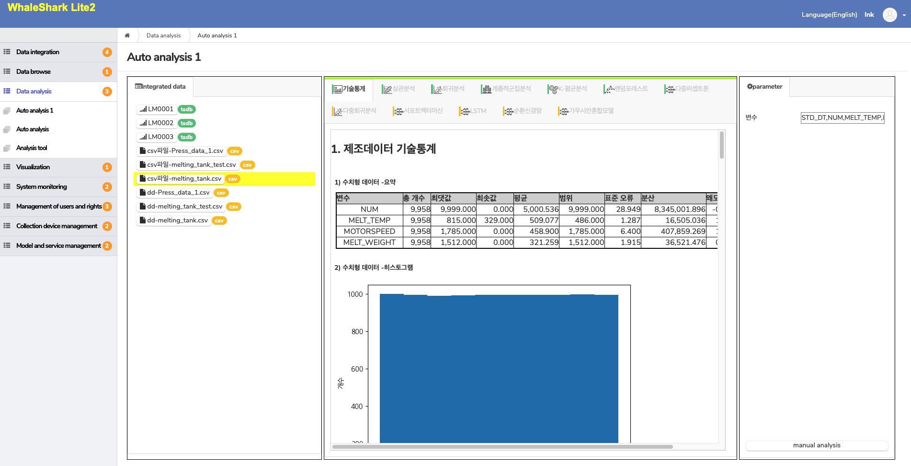
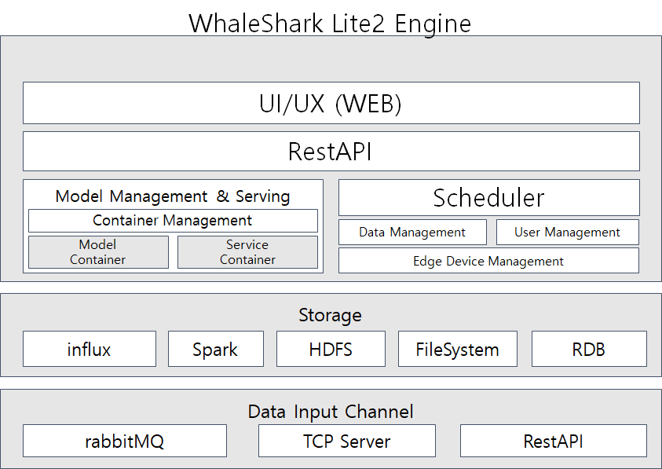

# WhaleShark AIoT Platform

## 프로젝트 개요

WhaleShark AIoT 플랫폼에 대한 소스 코드를 관리하는 프로젝트 저장소 입니다. 
WhaleShark AIoT 플랫폼은 산업 현장에서 설치되어 데이터를 수집하고 처리하는 AIoT, IIoT 기기들과 각 센서들의 연결 제어를 하고 수집되는 데이터에 대한 저장 및 처리에 대한 기능을 수행하며 각각의 기기에서 동작하는 AI 모델 및 IoT 서비스에 대한 배포 기능을 수행하는 등의 AIoT 서비스를 운용하기 위한 핵심적인 기능들을 제공합니다.

 

## 주요 기능

WhaleShark는 AIoT 플랫폼으로 아래 5가지 주요 기능을 가지고 있습니다.

* IoT 데이터 분석 
  * 수집된 데이터를 자동 분석하는 기능
  * 기술 통계, 상관 분석, 분류/회귀/군집 등의 다양한 머신러닝 알고리즘을 제공
* IoT 센서/기기 관리
  * IoT 기기 통신을 위하여  MQ, TCP, RestAPI 등의 인터페이스를 지원
  * 센서 기기의 정보를 등록하고 수집되는 데이터의 메타를 정의하는 기능
  * IoT 기기의 정보를 등록하고 연결되는 센서를 제어 및 모니터링하는 기능
* 데이터 관리
  * 센서로부터 수집되는 데이터를 관리하는 기능
  * Influx, HDFS, FileSystem, RDB(MaridaDB) 등 다양한 데이터 저장소를 지원
* AI 모델 관리
  * AI 모델 파일을 등록하고 AIoT 기기로 배포하는 기능
* IoT 서비스 관리
  * IoT 서비스 배포 파일을 등록하고 IoT 기기로 서비스를 배포하는 기능
* 사용자 관리
  * 플랫폼 사용자에 대한 로그인, 그룹, 접근 권한 등을 관리하는 기능

 

## 프로젝트 개발 환경
* 개발 언어 : JAVA (OpenJDK 1.8)
* Web Framework : Spring boot 2.0, Bootstrap 4.0
* 빌드 도구 : Maven 3.6
* WAS : Apache tomcat 8.5
* RDB : MariaDB 10.3

